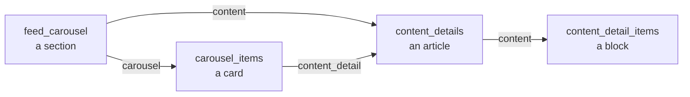

# Sample data — turn the starter into a real app in ~10 minutes

This app has **no hardcoded screens**. The home feed, the cards, the article pages — all of it is
rendered from four CMS content types. Change the data and you change the app: the same build ships
as a blog, a movie catalog, a nonprofit app or a training app.

That is what this folder is for. Import a schema once, import a dataset on top, run the app.

> **Skip the manual route:** connect the AppAmbit MCP server and one prompt does all of this for
> you — content types, every entry with its relations resolved, the auth table, your `.env`. See
> [**AUTOMATED-SETUP.md**](AUTOMATED-SETUP.md). The rest of this file is the manual path and the
> reference for authoring your own content.

```
samples/
├── AUTOMATED-SETUP.md               ← one prompt, backend configured for you
├── schema/
│   ├── content-types.json           ← the 4 content types. Import this FIRST, once.
│   └── content-types.raw-dump.json  ← raw dashboard export (includes older iterations, reference only)
├── datasets/
│   ├── starter-demo.json            ← the mixed demo content the reference app ships with
│   ├── blog.json                    ← magazine / publisher
│   ├── movies.json                  ← streaming catalog
│   ├── nonprofit.json               ← community organization
│   └── fitness.json                 ← coaching / training
├── screenshots/                     ← example images in repo
└── check-images.py                  ← verify your art fits the card slots before uploading
```

---

## Quick start

### 1. Create the app in AppAmbit

Dashboard → new app (one per platform). Copy each `app_key` into `.env` at the repo root:

```sh
cp .env.example .env
```

```
APPAMBIT_APP_KEY_ANDROID=<your android app key>
APPAMBIT_APP_KEY_IOS=<your ios app key>
```

Push notifications are separate from content: your Firebase file goes at
`android/app/google-services.json` (there is a placeholder next to it,
`google-services-example.json`, showing the expected shape). Full steps in the
[root README](../README.md#push-notifications-setup).

### 2. Import the schema

`schema/content-types.json` is already shaped for the AppAmbit MCP `create-content-type-tool` —
pass its `content_types` array in one call. Then do the one thing the tool cannot express:

> In the dashboard, set **`feed_carousel.carousel`** and **`content_details.content`** to a
> **many** relation. Without it, a section can only hold a single card.

### 3. Import a dataset

Pick one from `datasets/`. Each file lists its own `import_order` — follow it, because relations
point up the chain:

```
content_detail_items  →  content_details  →  carousel_items  →  feed_carousel
```

Every group in `entries` maps 1:1 to a `create-content-entry-tool` call
(`content_type` + `entries`). Stringify each `data` object — the tool wants JSON as a string.

### 4. Wire the relations

Relations are stored as **tokens**, not UUIDs, because entry ids differ in every organization:

```json
"carousel": ["@carousel_items:blog_deep_pricing", "@carousel_items:blog_deep_seo"]
```

`@<content_type>:<lookup_key>` — for `content_details` the key is its `title`.

There is **no update-entry tool**, so tokens have to be resolved *before* an entry is created, not
patched afterwards: keep a `lookup_key → id` map from each create call and substitute into the next
batch. Following `import_order` makes this work on the first pass — it is bottom-up, so every
relation target already exists by the time something points at it. (Linking by hand in the dashboard
afterwards also works, it is just slower.)

### 5. Run

```sh
npm start
npm run ios      # or: npm run android
```

Home feed populated on first launch.

---

## The zero-friction path

Connect the AppAmbit MCP server to your assistant and every step above happens for you — including
the token→id resolution, which is the tedious part, and the auth table. Setup, the full prompt and
its one manual checkpoint are in [**AUTOMATED-SETUP.md**](AUTOMATED-SETUP.md).

Short version, once the server is connected:

```
Import samples/schema/content-types.json and samples/datasets/movies.json into my AppAmbit app
<app_key>. Follow import_order and resolve every @content_type:lookup_key token to the real entry
id as you go, before creating the entry that references it.
```

By hand it is the same two tools: `create-content-type-tool`, then `create-content-entry-tool` four
times in `import_order`.

---

## Datasets

Every dataset uses the **same four content types**. Only the rows differ.

| Dataset | The app it makes | Sections | Cards |
| --- | --- | --- | --- |
| `starter-demo.json` | Mixed-topic demo (productivity, travel, finance, food, pets, design) | 9 | 19 |
| `blog.json` | Editor's picks, culture, deep dives, quick reads | 5 | 12 |
| `movies.json` | Now playing, series to binge, curated collections | 5 | 12 |
| `nonprofit.json` | Get involved, programs, impact report, community stories | 5 | 12 |
| `fitness.json` | Programs, workouts, nutrition, recovery | 5 | 12 |

The four themed datasets share an identical shape — one featured row, two small rows, one large
row, one full-width banner backed by a rich article. Swapping between them is a content import,
not a code change. That is the point: **your vertical is a dataset, not a fork.**

---

## Images

Themed datasets ship with every image field `null` so they import cleanly. Filling them is the one
step where "it imported fine but looks wrong" usually happens, so the sizes are not left to taste.

### The five slots

Every image lands in one of five places. The app renders all of them with `resizeMode: cover`, so
anything that is not the right shape gets **center-cropped, not letterboxed**.

| Slot | Where it shows | Ratio | Ship at | Source of truth |
| --- | --- | --- | --- | --- |
| `hero` | `featured` cards, full-bleed at the top of the feed | **4:5** | 1200×1500 | [`FeaturedCard.tsx`](../src/components/cards/FeaturedCard.tsx) — full width × 480pt |
| `large` | Large cards in a horizontal carousel | **5:3** | 1200×720 | [`HomeScreen.tsx`](../src/screens/HomeScreen.tsx) — 85% of screen width × 0.6 |
| `banner` | Full-width banner (`large` + `is_collection: false`) | **5:3** | 1200×720 | [`SingleLargeCard.tsx`](../src/components/cards/SingleLargeCard.tsx) |
| `small` | Small cards in a horizontal carousel | **16:9** | 960×540 | [`SmallCard.tsx`](../src/components/cards/SmallCard.tsx) — 160pt wide |
| `block` | `image` blocks inside a detail screen | **5:3** | 1200×720 | [`ContentBlock.tsx`](../src/components/common/ContentBlock.tsx) |

**Two masters cover everything**: one 4:5 portrait for hero cards, one 5:3 landscape for the rest
(16:9 loses ~7% off the sides on small cards — unnoticeable).

Three rules that matter more than the pixel counts:

1. **Center the subject.** Cover-crop trims whatever does not fit.
2. **Keep the bottom 40% quiet** on hero, large and banner art — a dark gradient plus the title and
   subtitle sit on top of it.
3. **No text baked into the image.** It will not survive the crop, and it cannot be translated or
   restyled from the CMS.

### Which image goes where

Each dataset carries an `images` block mapping every section to its slot, the cards it covers, and
what the photo should show:

```json
"movie_now_playing": {
  "slot": "hero",
  "aspect_ratio": "4:5",
  "recommended_px": "1200x1500",
  "field": "carousel_items.image",
  "applies_to": ["movie_new_dune", "movie_new_heat", "movie_new_arrival"],
  "subject": "Key art with the subject centered — poster crops get trimmed at the sides"
}
```

### Check before you upload

```sh
python3 samples/check-images.py ~/Desktop/app-images
```

No dependencies. It reads PNG/JPEG/WebP headers, matches each file to the closest slot (or to the
slot its filename starts with — `hero-welcome.png`), and flags wrong ratios and images too small to
stay sharp on a 3x screen:

```
  OK  hero-welcome.png — 1200x1500 (0.80) → hero
  !!  square-logo.png — 800x800 (1.00) → hero
       ratio 1.00 vs 0.80 for 'hero' — off by 25%, edges will be cropped
       only 800px wide, want 1200px+ for a 3x screen
```

### Getting the URLs into the CMS

Upload in the AppAmbit dashboard media library, then set `image` / `banner_image` on the entry. The
API returns an expanded `image_url` next to the stored filename, and the app prefers it
([`feedParser.ts`](../src/utils/feedParser.ts) → `image_url ?? image`).

Because of that fallback, a **plain `https://` URL also works** if your art already lives on a CDN —
[`resolveImageUri`](../src/utils/image.ts) passes strings straight through. Handy for prototyping;
prefer the media library for anything shipping, so images stay versioned with the content.

A missing image is safe: cards check the URI and render the text-only layout instead of a broken
box. A *wrong* URL is the bad case — it fails silently and leaves a blank area, which is exactly
what the checker above is for.

`starter-demo.json` keeps the original file names from the reference app's media library — those
resolve to nothing in your organization, so replace them with your own uploads.

---

## Screenshots

Not committed yet — capture them from your own build so they show your content:

```sh
npm run ios
./samples/screenshots/capture.sh ios home
```

See [`screenshots/README.md`](screenshots/README.md) for the full list worth capturing
(home, detail, notifications, auth, profile).

---

## How the data drives the UI

Read this before authoring your own dataset — it is the whole contract.



**`feed_carousel`** — one row per home-feed section. Two fields decide the renderer:

| `card_type` | `is_collection` | Renders as |
| --- | --- | --- |
| `featured` | `true` | Merged into the single hero carousel at the top of the feed |
| `large` | `true` | Horizontal carousel of large cards |
| `large` | `false` | One full-width banner card |
| `small` | `true` | Horizontal carousel of small cards |

`display_order` sorts the sections. `featured` rows from *every* section are merged into one hero
carousel, so multiple featured sections still produce a single row.

**`carousel_items`** — the cards. `title`, `subtitle`, `badge`, `image`, and an optional
`content_detail` relation. A card without `content_detail` opens a detail screen built from its own
title/subtitle.

**`content_details`** — an ordered list of blocks. The order of the `content` array *is* the render
order.

**`content_detail_items`** — the blocks themselves. `type` picks the renderer:

| `type` | Fields it uses |
| --- | --- |
| `text` | `text` (rich HTML — headings, paragraphs, inline images) |
| `image` | `banner_image` |
| `video` | `banner_video` (URL, tap to play) |
| `button` | `button_text`, `button_url`, `button_color` |

---

## Making your own dataset

Copy the closest themed file and rewrite the rows. Rules that will bite you otherwise:

- `lookup_key` is required on `feed_carousel` and `content_detail_items`, and it is what the
  `@` tokens resolve against — keep it unique per content type.
- `content_details` has no `lookup_key`; its `title` is the token key, so titles must be unique.
- `card_type` accepts only `featured`, `large`, `small`. `type` accepts only `button`, `text`,
  `image`, `video`.
- `is_collection` and `display_order` are required on every section.
- Ship `status: "published"` — draft entries never reach the SDK.

Validate before importing:

```sh
python3 - <<'EOF'
import json
d = json.load(open('samples/datasets/blog.json'))
print({g['content_type']: len(g['entries']) for g in d['entries']})
EOF
```

Beyond the feed, the pieces you will likely touch: `ORG_INFO` in
[`src/screens/AboutScreen.tsx`](../src/screens/AboutScreen.tsx) (name, links, contact), the palette
in [`src/theme/colors.ts`](../src/theme/colors.ts), and the tab list in
[`src/navigation/BottomTabNavigator.tsx`](../src/navigation/BottomTabNavigator.tsx).
