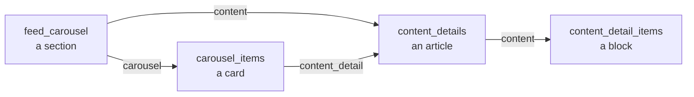

# Sample content — turn the starter into a real app

The app has **no hardcoded screens**. The home feed, every card and every article page are built from four CMS content types. Change the data and you change the app — no rebuild, no developer.

That is what this folder is for. Import a schema once, import a dataset on top, run the app.

```
samples/
├── AUTOMATED-SETUP.md               ← one prompt, backend configured for you
├── schema/
│   └── content-types.json           ← the 4 content types. Import this FIRST, once.
├── datasets/
│   ├── starter-demo.json            ← mixed demo content
│   ├── blog.json                    ← magazine / publisher
│   ├── movies.json                  ← cinema billboard
│   ├── nonprofit.json               ← community organization
│   └── fitness.json                 ← coaching / training
└── screenshots/                     ← the same build, three different datasets
```

---

## Pick your path

| | What it is | Time |
| --- | --- | --- |
| ⚡ **[Automated](AUTOMATED-SETUP.md)** | Connect the AppAmbit MCP server, paste one prompt. It creates the content types, every entry, the relations, the auth table and your `.env`. | ~5 min |
| ✋ **[Manual](#manual-import)** | Import through the dashboard yourself. Slower, but you see exactly what is created. | ~20 min |

Both end in the same place. The automated path is described in
[**AUTOMATED-SETUP.md**](AUTOMATED-SETUP.md) - read the rest of this file when you want to
understand the data model or write your own dataset.

---

## Manual import

### Step 1 — Create the app and set your keys

1. Go to the [AppAmbit dashboard](https://appambit.com) and create an app **per platform** (one iOS,
   one Android).
2. Copy the repo's env template:

   ```sh
   cp .env.example .env
   ```

3. Paste each `app_key` into `.env`:

   ```
   APPAMBIT_APP_KEY_ANDROID=<your android app key>
   APPAMBIT_APP_KEY_IOS=<your ios app key>
   ```

Push notifications are configured separately — see
[Push notifications setup](../README.md#push-notifications-setup) in the root README.

### Step 2 — Import the schema

`schema/content-types.json` holds the four content types every dataset uses. Import it **once per
app**.

- **Using the MCP server:** pass its `content_types` array to `create-content-type-tool` in a single
  call.
- **By hand:** recreate the four types and their fields in the dashboard.

Then do the one thing the import cannot express:

> ⚠️ **Switch two fields to _many_ relations in the dashboard:**
> - **Feed Carousel** → field `carousel`
> - **Content Details** → field `content`
>
> Skip this and a section can only ever hold one card.

### Step 3 — Import a dataset

Pick one file from `datasets/`. Each one lists its own `import_order` — follow it exactly, because
relations point up the chain:

```
content_detail_items  →  content_details  →  carousel_items  →  feed_carousel
```

Every group in the file's `entries` array maps 1:1 to one `create-content-entry-tool` call:

- Pass `content_type` and that group's `entries`.
- Stringify each `data` object — the tool wants JSON as a string.
- Keep `status: "published"`. Drafts never reach the SDK.

### Step 4 — Resolve the relations

Relations in the datasets are stored as **tokens**, not ids, because entry ids differ in every organization:

```json
"carousel": ["@carousel_items:blog_deep_pricing", "@carousel_items:blog_deep_seo"]
```

The format is `@<content_type>:<lookup_key>`. Two rules:

- For most types the key is the entry's `lookup_key`.
- For `content_details` there is no `lookup_key` - its **`title`** is the key.

**There is no update-entry tool**, so a token has to become a real id *before* the entry that uses it is created. It cannot be patched afterwards. In practice:

1. Create a group of entries.
2. Keep the `lookup_key → id` map the call returns.
3. Substitute those ids into the next group.

Following `import_order` makes this work on the first pass — it is bottom-up, so every relation target already exists by the time something points at it. Linking by hand in the dashboard afterwards also works, it is just slower.

### Step 5 — Run

```sh
npm start
```

```sh
npm run ios
```

Register an account and the home feed shows your imported content.

---

## What you get

The same build, three different datasets — nothing changed but the CMS rows.

| `movies.json` | `movies.json` — detail screen |
| --- | --- |
|  |  |

More captures in [`screenshots/`](screenshots/): `blog/`, `fitness/` and `movies/` show the feed and
detail screens per dataset, plus `about.png`, `notifications.png` and `profile.png` for the other
tabs.

---

## The datasets

All five use the **same four content types**. Only the rows differ.

| Dataset | The app it makes | Sections | Cards |
| --- | --- | --- | --- |
| `starter-demo.json` | Mixed-topic demo — productivity, travel, finance, food, pets, design | 9 | 19 |
| `blog.json` | Editor's picks, culture, deep dives, quick reads | 5 | 12 |
| `movies.json` | Now showing, genre rows, editorial spotlight | 5 | 12 |
| `nonprofit.json` | Get involved, programs, impact report, community stories | 5 | 12 |
| `fitness.json` | Programs, workouts, nutrition, recovery | 5 | 12 |

The four themed datasets share an identical shape:

- 1 featured row (the hero carousel)
- 2 small rows
- 1 large row
- 1 full-width banner backed by a rich article

Swapping between them is a content import, not a code change. That is the point: **your vertical is a dataset, not a fork.**

---

## How the data drives the UI

Read this before authoring your own dataset — it is the whole contract.



### `feed_carousel` one row per home-feed section

Two fields decide how a section renders:

| `card_type` | `is_collection` | Renders as |
| --- | --- | --- |
| `featured` | `true` | Merged into the single hero carousel at the top of the feed |
| `large` | `true` | Horizontal carousel of large cards |
| `large` | `false` | One full-width banner card |
| `small` | `true` | Horizontal carousel of small cards |

- `display_order` sorts the sections.
- `featured` rows from *every* section are merged into one hero carousel, so multiple featured
  sections still produce a single row.

### `carousel_items` — the cards

- Fields: `title`, `subtitle`, `badge`, `image`.
- Optional `content_detail` relation points at the article the card opens.
- A card **without** `content_detail` still opens a detail screen, built from its own title and
  subtitle.

### `content_details` — an article

- An ordered list of blocks.
- The order of the `content` array **is** the render order.

### `content_detail_items` — the blocks

`type` picks the renderer:

| `type` | Fields it uses |
| --- | --- |
| `text` | `text` — rich HTML: headings, paragraphs, inline images |
| `image` | `banner_image` |
| `video` | `banner_video` — a URL, tap to play |
| `button` | `button_text`, `button_url`, `button_color` |

---

## Images

Themed datasets ship with every image field `null` so they import cleanly. Filling them is the one step where "it imported fine but looks wrong" usually happens, so the sizes are not left to taste.

### The five slots

Every image lands in one of five places. The app renders all of them with `resizeMode: cover`, so anything that is not the right shape gets **center-cropped, not letterboxed**.

| Slot | Where it shows | Ratio | Ship at | Source of truth |
| --- | --- | --- | --- | --- |
| `hero` | `featured` cards, full-bleed at the top of the feed | **4:5** | 1200×1500 | [`FeaturedCard.tsx`](../src/components/cards/FeaturedCard.tsx) |
| `large` | Large cards in a horizontal carousel | **5:3** | 1200×720 | [`HomeScreen.tsx`](../src/screens/HomeScreen.tsx) |
| `banner` | Full-width banner (`large` + `is_collection: false`) | **5:3** | 1200×720 | [`SingleLargeCard.tsx`](../src/components/cards/SingleLargeCard.tsx) |
| `small` | Small cards in a horizontal carousel | **16:9** | 960×540 | [`SmallCard.tsx`](../src/components/cards/SmallCard.tsx) |
| `block` | `image` blocks inside a detail screen | **5:3** | 1200×720 | [`ContentBlock.tsx`](../src/components/common/ContentBlock.tsx) |

**Two masters cover everything:** one 4:5 portrait for hero cards, one 5:3 landscape for the rest. (16:9 loses about 7% off the sides on small cards — unnoticeable.)

### Three rules that matter more than the pixel counts

1. **Center the subject.** Cover-crop trims whatever does not fit.
2. **Keep the bottom 40% quiet** on hero, large and banner art — a dark gradient plus the title and
   subtitle sit on top of it.
3. **No text baked into the image.** It will not survive the crop, and it cannot be translated or
   restyled from the CMS.

### Which image goes where

Each dataset carries an `images` block mapping every section to its slot, the cards it covers, and
what the photo should show:

```json
"movie_now_showing": {
  "slot": "hero",
  "aspect_ratio": "4:5",
  "recommended_px": "1200x1500",
  "field": "carousel_items.image",
  "applies_to": ["movie_mission_impossible", "movie_fantastic_four", "movie_jurassic_world"],
  "subject": "Movie poster key art, subject centered — vertical crops trim the sides"
}
```

### Getting the URLs into the CMS

- **Recommended:** upload in the AppAmbit dashboard media library, then set `image` /
  `banner_image` on the entry. The API returns an expanded `image_url` next to the stored filename,
  and the app prefers it ([`feedParser.ts`](../src/utils/feedParser.ts) → `image_url ?? image`).
- **Also works:** a plain `https://` URL, if your art already lives on a CDN —
  [`resolveImageUri`](../src/utils/image.ts) passes strings straight through. Handy for prototyping;
  prefer the media library for anything shipping, so images stay versioned with the content.

Two things to know:

- A **missing** image is safe — cards check the URI and render the text-only layout instead of a
  broken box.
- A **wrong** URL is the bad case — it fails silently and leaves a blank area.

> `starter-demo.json` keeps the original file names from the reference app's media library. Those resolve to nothing in your organization, replace them with your own uploads.

---

## Making your own dataset

Copy the closest themed file and rewrite the rows. Five rules that will bite you otherwise:

1. **`lookup_key` is required** on `feed_carousel` and `content_detail_items`, and it is what the
   `@` tokens resolve against — keep it unique per content type.
2. **`content_details` has no `lookup_key`** — its `title` is the token key, so titles must be
   unique.
3. **`card_type`** accepts only `featured`, `large`, `small`.
4. **`type`** accepts only `text`, `image`, `video`, `button`.
5. **`is_collection` and `display_order` are required** on every section, and everything must ship
   `status: "published"` — drafts never reach the SDK.

Beyond the feed, the pieces you will likely want to change:

- **Org name, links and contact** — `ORG_INFO` in
  [`src/screens/AboutScreen.tsx`](../src/screens/AboutScreen.tsx)
- **Colors and type** — [`src/theme/`](../src/theme/)
- **Tabs** — [`src/navigation/BottomTabNavigator.tsx`](../src/navigation/BottomTabNavigator.tsx)

---

**Next:** [AUTOMATED-SETUP.md](AUTOMATED-SETUP.md) for the one-prompt path · [root
README](../README.md) for building, running and shipping the app.
